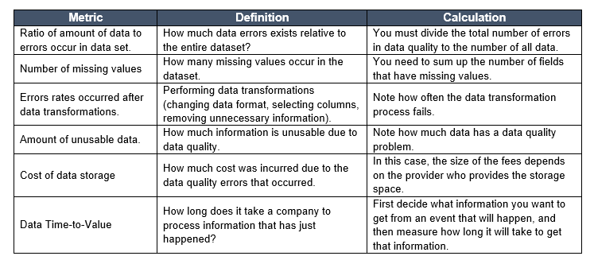

# Data Quality Checker

Data Quality Checker is a Python-based GUI application designed to help users evaluate the quality of data in CSV files by running a series of data validation checks. It provides insights into various data quality metrics, such as missing values, duplicate records, date format consistency, and more, making it easier to identify issues that may affect data reliability and integrity.

## Why This Application Exists

Data quality is a critical aspect of data management, especially as datasets grow in size and complexity. Inconsistent, incomplete, or inaccurate data can lead to incorrect analyses, poor decision-making, and overall inefficiency. The Data Quality Checker app was built to streamline the process of identifying data quality issues, allowing users to:

- Quickly load a CSV file and perform automated quality checks.
- Visualize data quality results in a structured, easy-to-read table format.
- Assess the "Error Ratio" (ratio of data errors to total data points) to better understand the quality of their data at a glance.

This application is ideal for data professionals, analysts, and engineers who need a quick and effective way to assess data quality before diving into data analysis.

## Features

- **Automated Data Quality Checks**: Runs a suite of data validation checks on a loaded CSV file, covering:
  - Missing values
  - Duplicate records
  - Date format consistency
  - Out-of-range values
  - Non-unique identifiers
  - Invalid categorical values
- **Error Ratio Calculation**: Calculates the ratio of data errors to the total number of data points in the dataset, providing a summary of overall data quality.
- **User-Friendly Interface**: Built with `Tkinter`, the app provides an intuitive GUI with tabular result displays using `Treeview`, making it easy to interpret quality check results.
- **Reference Image Display**: Includes a visual reference of the data quality metrics directly in the app for easy access.

## Requirements

- Python 3.6+
- `pandas` for data manipulation
- `tkinter` for GUI (included with Python)
- `Pillow` for image processing
- `openpyxl` for Excel file saving (optional)

## Installation

quick install

```bash
pip install -r requirements.txt
```

1. **Clone the Repository**:

   ```bash
   git clone https://github.com/yourusername/Data-Quality-Checker.git
   cd Data-Quality-Checker
   ```

2. **Create Virtual Enviroment**

```bash
python -m venv venv
```

active virtual environment

```bash
venv\Scripts\activate
```

3. **Install Dependencies**:
   Ensure you have the required packages installed. You can install them via `pip`:

   ```bash
   pip install pandas pillow openpyxl
   ```

4. **Place Reference Image**:
   Add the `reftable.png` image (the reference table for data quality metrics) in the same directory as the application script to display it within the app.

## Usage

1. **Launch the Application**:
   Run the Python script:

   ```bash
   python app.py
   ```

2. **Load a CSV File**:

   - Click on "Load CSV File" to select a CSV file for quality assessment.

3. **Run Data Quality Checks**:

   - Click on "Run Data Quality Checks" to perform a series of data validation checks. Results will be displayed in a table format within the app, with each metric and its corresponding result.

4. **Review Data Quality**:
   - Review the results in the table. The app provides detailed information on each quality metric, including the error count for each check and the overall error ratio.

## Data Quality Checks

### Metrics for measuring data quality in data warehouses



The following checks are run on the dataset:

1. **Missing Values**: Identifies any empty or null values.
2. **Duplicate Records**: Detects duplicate rows in the data.
3. **Date Format Consistency**: Ensures date fields follow a specified format.
4. **Out-of-Range Values**: Flags values outside predefined ranges (e.g., age should be between 0 and 120).
5. **Non-Unique Identifiers**: Ensures uniqueness for fields that require it (e.g., user IDs).
6. **Invalid Categorical Values**: Confirms categorical fields (e.g., subscription type) contain only valid values.
7. **Error Ratio Calculation**: Calculates the percentage of data points with errors relative to the entire dataset.

## Example

When you run the application and load a CSV file, you’ll see an output table like this in the GUI:

| Data Quality Check         | Result     |
| -------------------------- | ---------- |
| Missing Values             | 3          |
| Duplicate Records          | 2          |
| 'Join Date' Date Format    | Consistent |
| Out-of-range Age Values    | 0          |
| Non-unique User IDs        | 1          |
| Invalid Subscription Types | 4          |
| **Error Ratio**            | 1.27%      |

This table summarizes the data quality issues, helping you quickly assess and address data problems.

## License

This project is licensed under the MIT License - see the LICENSE file for details.

## Contributing

We welcome contributions to enhance the functionality of this application. Feel free to open issues, submit pull requests, or reach out with any suggestions!

## Contact

For any inquiries or further assistance, please contact [devrimsavasyilmaz@gmail.com](mailto:devrimsavasyilmaz@gmail.com).

2024 DEvrim Savas Yilmaz
